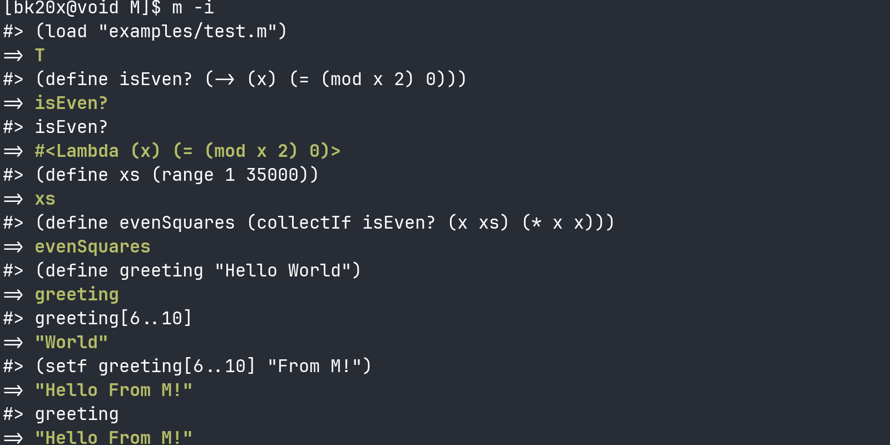
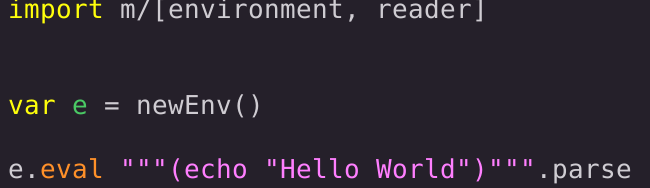

# λ ((M))  
#### A Lisp-1 like language that emphasizes transparency, flexibility, extensibility and most importantly masterability; The core of the language excluding Stdlib is only about 1600 lines of structured self documenting code; Using nothing but the Nim standard library Besides `bigints`
#### Still a work in progress but it is already a capable tool for systems scripting or embedding in any Nim Application.  you can instantiate the interpreter in 1 line of code and its trivial to extend with builtins 
###### to install M from nimble run: `nimble install m`. to build from source , clone the repo and run: `nimble build`, to launch the interpreter in repl mode run `m -i` otherwise run `m filename.m`;  code examples are below the Features section and in the `examples` directory 

# Features
* Comparable in speed to compiled languages; recursive factorial of 10000 computes at `|real 0m0.034s| | sys 0m0.003s |`
* Extremely lightweight; uses about 1.6 to 2.2 mb of memory on startup and will only use memory that is actually in use
* Safe and fast Infinite recursion
* First class functions and symbols
* Powerful Macros and Backquote
* Direct metaprogramming (Lambdas are structures allowing for hot swapping of code); code is data in a much more literal sense than Scheme or CL
* The Reader can natively parse JSON into Tables
* Seq/Table literals and dot notation for field access
* Slicing and indexing for Seqs and Strings as well as mutating these slices
* Batteries included Standard library (Still WIP)
* Trivially extensible with native code and embedded within applications
* Completely cross platform; can fit in flash memory

# Some Examples ^_^

- Embed in any nim app in 2 lines
---

```
(open SysIo Strings)

(echo "Hello World!")

'(table examples
  support for table literals inspired by Lua
  you can even use them as modules)

(define vec2 {x: 250.0, y: 250.0}) 

(define Vectors {
  Vector2: (-> (x y) {x: x, y: y})
})

(define pos (Vectors.Vector2 25.0 25.0)) 
(echo (fmt "x=$  y=$" pos.x pos.y))


'(macro examples)

(macro collect (binding body)
 (let ((var        (car binding))
       (collection (car (cdr binding))))
  `(map ,collection (-> (,var) ,body))))  '(macros and backquote inspired by CL)

(define xs (collect (x '(2 4 6 8)) (* x x))) 


'(recursion examples, recursion is fast, completely separated from the hardware callstack)

(define last (-> (xs) (if (cdr xs) (last (cdr xs)) (car xs))))

(define factorial (-> (n acc)
  (if (= n 0)
       acc
      (factorial (- n 1) (* acc n))))) 


'(IO and data transformation capabilities)
(define readDir (-> (dir) (map (filter (listDir dir) isFile?) readFile))) 


'(indexing/slicing)

(define str "Yoben Boben")
(echo str[5..(- (strLen str) 1)])

(define nums [1,2,3,4,5])
(echo nums[1..3])
(setf nums[1..3] [9, +, 10, =, 21])
(echo nums)

'(mutate/inspect a function directly)

(define f (-> (x) (* x x)))
(echo (f 10))
(setb f '(echo "I dont square numbers anymore!"))
(f 10)

(echo (body f))
(echo (lparams f))
```
